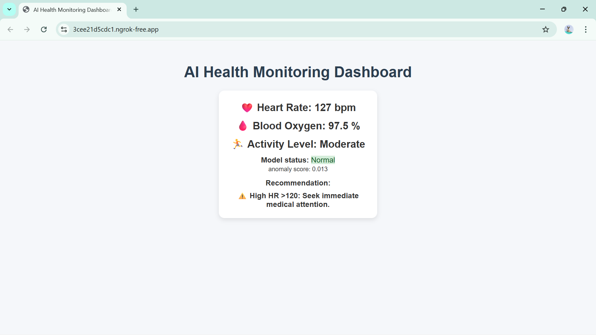
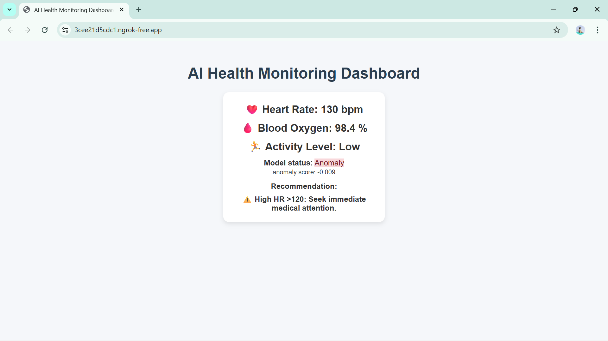
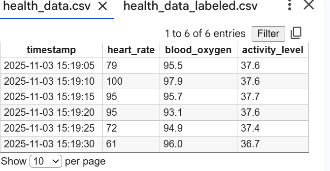
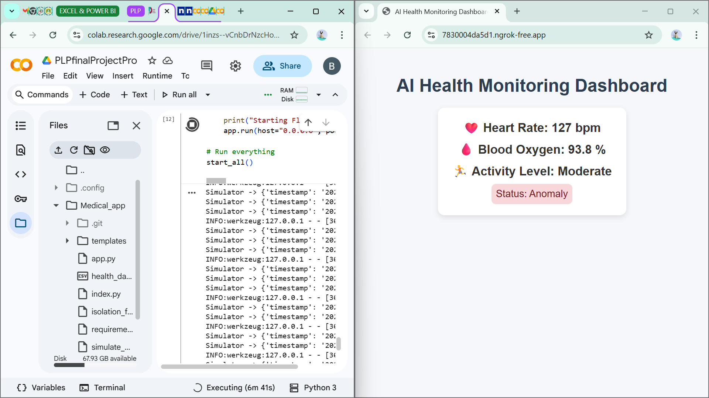
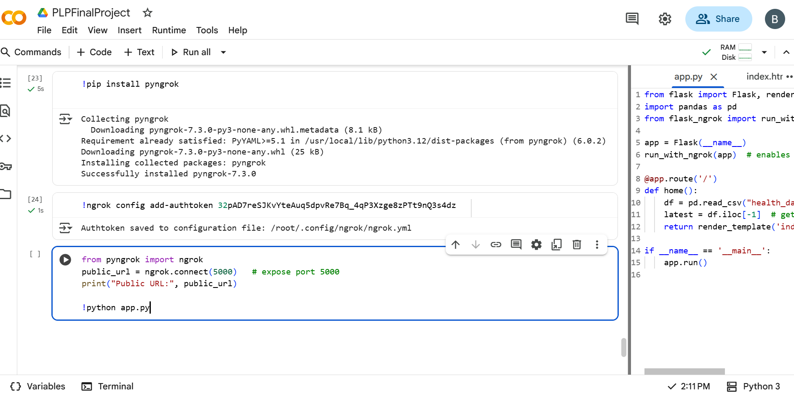

# 🩺 AI-Powered Health Monitoring System

A web-based system that simulates real-time health data, detects anomalies using Isolation Forest, and displays results via Flask.

## 🚀 Features
- Real-time physiological data simulation
- AI-based anomaly detection
- Web dashboard powered by Flask
- Ngrok tunnel for public access

## ⚙️ Setup
1. Clone this repo or upload the files to Google Colab.
2. Install requirements:
   ```bash
   pip install -r requirements.txt
3. Run the simulator:
   python simulate_data.py
4.  Start the Flask app:
   python app.py

Access your app through the ngrok link displayed in the Colab output.

## .gitignore (optional but helpful)**

This file tells Git which files *not to upload* to GitHub (like cache files, ngrok logs, etc.).

Example:
```text
  __pycache__/
  *.pyc
  *.pkl
  ngrok.log
  .env

## 📦 Deliverables
- `app.py`
- `simulate_data.py`
- `model_training.py`
- `isolation_forest_model.pkl`
- Screenshots and a 50-word summary for submission.

## 🖼️ Screenshots

| Dashboard 1 | Dashboard 2 |
|--------------|--------------|
| 
 | 
 |

| CSV View | Building Environment | Coding |
|-----------|-----------------------|--------|
|  |  |  |

